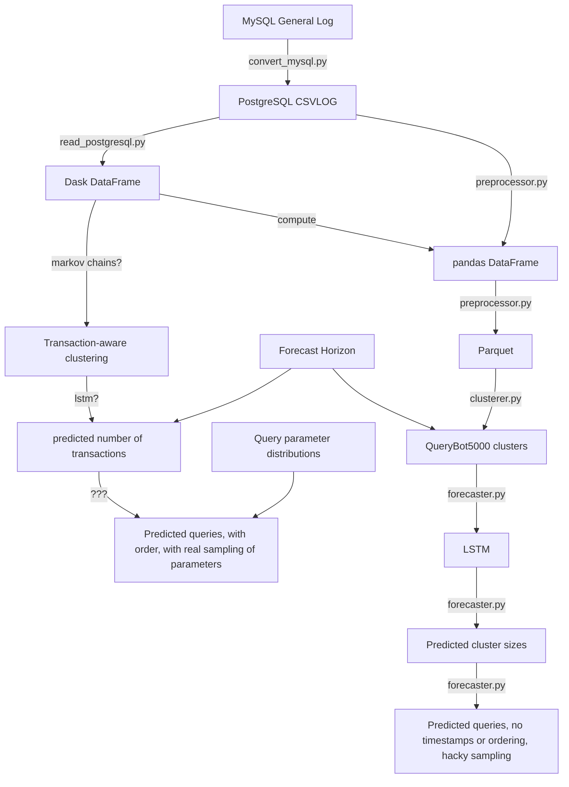

# noisepage-forecast

Currently believed to be a temporary repo.

```mermaid
flowchart
DDF[Dask DataFrame]
FH[Forecast Horizon]
GOAL[Predicted queries, with order, with real sampling of parameters]
MGL[MySQL General Log]
PCL[PostgreSQL CSVLOG]
PDF[pandas DataFrame]
PQ[Parquet]
QB5000C[QueryBot5000 clusters]
QB5000L[LSTM]
QB5000R[Predicted queries, no timestamps or ordering, hacky sampling]
QB5000S[Predicted cluster sizes]
QPD[Query parameter distributions]
TXC[Transaction-aware clustering]
TXR[predicted number of transactions]

%% Generic preprocessing.
MGL -->|convert_mysql.py| PCL
PCL -->|read_postgresql.py| DDF
DDF -->|compute| PDF

%% QueryBot5000 path.
PCL -->|preprocessor.py| PDF
PDF -->|preprocessor.py| PQ
FH --> QB5000C
PQ -->|clusterer.py| QB5000C
QB5000C -->|forecaster.py| QB5000L
QB5000L -->|forecaster.py| QB5000S
QB5000S -->|forecaster.py| QB5000R

%% New code path.
DDF -->|markov chains?| TXC
TXC -->|lstm?| TXR
FH --> TXR
TXR -->|???| GOAL
QPD --> GOAL
```